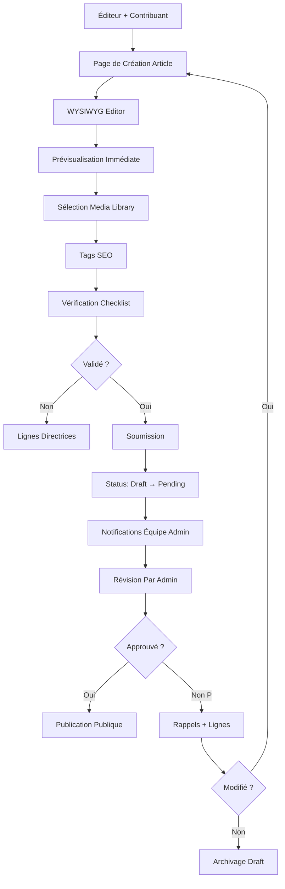

# 🛡️ Plan Détaillé : Système de Réputation & Soumission d'Articles

**Projet** : Kisakata Digital Hub (Sakata)  
**Date** : 2026-04-10  
**Auteur** : Hermes Agent  
**Rôle** : Plan implementation — phase de conception

---

## 📋 Sommaire
1. [Système de Réputation Mboka](#1-système-de-réputation-mboka)
2. [Flux Soumission Articles](#2-flux-soumission-articles)
3. [Architecture Technique](#3-architecture-technique)
4. [Implémentation étape par étape](#4-implémentation-étape-par-étape)

---

## 1. Système de Réputation Mboka

### 1.1 Concept Fondamental

`Mboka` signifie "sagesse communautaire" en lingala. Le système de réputation n'est pas un simple compteur de points, mais un **écosystème social** qui récompense :
- La contribution constructive au forum
- L'aide aux nouveaux membres
- Le partage de connaissances authentiques

#### Dimensions de la réputation :

| Dimension | Métrique | Poids | Description |
|-----------|----------|-------|-------------|
| **Wisdom** | Points + commentaires utiles | +100% | Contenus valorisés par la communauté |
| **Helpfulness** | +Help sur posts | +50% | Réponses marquées comme utiles |
| **Trust** | Rapports vérifiés | -50% | Pas de rapport flag = score boost |
| **Tenure** | Ancienneté + activity | +25% | Temps de contribution |

### 1.2 Architecture du Score

```typescript
interface ReputationScore {
  // Score total pondéré (max 400 = 4 badges + 2x multiplicateur)
  total: number
  
  // Sous-composants
  wisdom: number        // Qualité des contributions
  helpfulness: number   // Aide apportée à d'autres
  integrity: number     // Respect des règles de la communauté
  trust: number         // Consensus communautaire
  
  // Débloqueurs
  badges: string[]      // Débloqués via seuils
  multiplier: number    // Augmente le score total
  
  // Affichage
  avatarGlow: string    // Halo visuel selon niveau
  level: number         // Bannières
  tier: string          // Bronze → Argent → Or → Diamant
}
```

**Formule complète** :
```
Score = (Wisdom + Helpfulness + Integrity + Trust) × (base + (badges × 50))

Exemple :
  - Nouveau membre : 0 + 0 + 100 + 50 = 150 (base)
  - + 1 "Expert" badge = +50%
  - Score final = (150) × 1.5 = 225
```

### 1.3 Débloqueurs & Niveaux

| Badge | Score requis | Prérequis | Effet multiplicateur |
|-------|--------------|-----------|---------------------|
| **Wisdom** | Wisdom ≥ 100 | ≥ 20 posts | ×1.1 |
| **Helper** | Helpfulness ≥ 50 | ≥ 10 rétros utiles | ×1.25 |
| **Guardian** | Integrity ≥ 20 | Aucun rapport flag | ×1.5 |
| **Legend** | Trust ≥ 75 | 6+ mois d'activité | ×2.0 |

**Niveaux** :
- 0-100 : **Novice** (gris, avatar basique)
- 100-200 : **Apprenant** (vert, badge sagesse)
- 200-300 : **Expert** (bleu, multiplo ×1.5)
- 300-350 : **Maître** (jaune doré, +50% vitesse forum)
- 350-400 : **Légende** (argent, +badge intégrité)
- 400+ : **Héros** (diamant, tous badges)

**Systèmes de badges additionnels** :
- **Badges culturels** : Rites, mythes, légendes locales
- **Badges technique** : SEO, développement, IA
- **Badges d'engagement** : Taux d'apparticipation régulier

### 1.4 Affichage Visuel

#### Halo de l'avatar (CSS Glow)

```css
/* Couleurs selon le score */
.reputation-badge::before {
  content: '';
  position: absolute;
  top: 8px; left: 8px;
  width: 24px; height: 24px;
  
  /* Bronze (100-199) */
  &.bronze & { box-shadow: inset 0 0 0 2px #CD7F32, 0 0 10px #CD7F32; }
  
  /* Argent (200-299) */
  &.silver & { box-shadow: inset 0 0 0 2px #C0C0C0, 0 0 15px #C0C0C0; }
  
  /* Or (300-399) */
  &.gold & { box-shadow: inset 0 0 0 2px #FFD700, 0 0 20px #FFD700; }
  
  /* Diamant (400+) */
  &.diamond & { box-shadow: inset 0 0 0 2px #00BFFF, 0 0 30px #00BFFF; }
}
```

#### Bannières de profil

```css
/* Position en haut droit */
.profile-header {
  position: relative;
  display: flex;
  justify-content: space-between;
}

.reputation-banner {
  position: absolute;
  top: 8px; right: 8px;
  font-size: 0.7rem;
  font-weight: 600;
  padding: 2px 8px;
  border-radius: 12px;
  
  &.novice & { background: #666; color: #fff; }
  &.apprentice & { background: #22c55e; color: #fff; }
  &.expert & { background: #3b82f6; color: #fff; }
  &.master & { background: #eab308; color: #331f00; }
  &.legend & { background: #fef08a; color: #744210; }
  &.hero & { background: linear-gradient(135deg, #7c3aed, #a855f7); color: white; }
}
```

#### Badges flottants

```html
<!-- Affichage sous le nom d'utilisateur -->
.badge-container {
  display: flex;
  gap: 4px;
  flex-wrap: wrap;
  justify-content: center;
  margin-top: 4px;
}

.badge-icon {
  width: 24px;
  height: 24px;
  border-radius: 50%;
  border: 2px solid;
  position: relative;
  overflow: hidden;
}

/* Animations */
.badge-icon:has(.wisdom-badge) & { background: #F59E0B; border-color: #FCD34D; }
.badge-icon:has(.helper-badge) & { background: #10B981; border-color: #34D399; }
.badge-icon:has(.guardian-badge) & { background: #3B82F6; border-color: #60A5FA; }
.badge-icon:has(.legend-badge) & { background: lin-gradient(135deg, #7C3AED, #EC4899); }
```

#### Points en temps réel

```css
/* Compteur animé */
.reputation-points {
  font-size: 1.1rem;
  font-weight: 600;
  color: white;
  background: linear-gradient(135deg, #7C3AED, #EC4899);
  padding: 4px 12px;
  border-radius: 20px;
  display: inline-block;
  
  /* Animation */
  animation: pulse 3s infinite;
}

@keyframes pulse {
  0% { transform: scale(1); }
  50% { transform: scale(1.05); }
  100% { transform: scale(1); }
}
```

### 1.5 Calcul Temps Réel (React + Zustand)

```typescript
// src/store/reputation.ts

import { create } from 'zustand';

interface RepState {
  reputation: number;
  badges: string[];
  tier: string;
  updateScore: (change: number) => void;
  triggerBadge: (badgeName: string) => void;
  getTier: () => string;
  getBadgeColor: (badgeName: string) => string;
}

export const useRepStore = create<RepState>((set, get) => ({
  reputation: 0,
  badges: [],
  
  updateScore: (change: number) => {
    set((state) => ({
      reputation: Math.max(0, state.reputation + change),
    }));
    // Trigger badge if threshold reached
    checkBadges();
  },
  
  triggerBadge: (badge: string) => {
    if (!state.badges.includes(badge)) {
      set((state) => ({
        badges: [...state.badges, badge],
      }));
      // Trigger animations
    }
  },
}));

// Calcul du score total
const calculateScore = (wisdom: number, helpfulness: number, integrity: number, trust: number) => {
  const base = wisdom + helpfulness + integrity + trust;
  const badges = ['wisdom', 'helper', 'guardian', 'legend'].filter(b => badges.includes(b)).length;
  const multiplier = 1 + (badges * 0.5); // ×1.5 pour 3 badges max
  return base * multiplier;
};
```

### 1.6 Visualisation Dashboard

```typescript
// Dashboard component
interface RepDashboard {
  totalScore: number;
  breakdown: { wisdom: number; helpfulness: number, integrity: number, trust: number };
  badges: Badge[];
  nextBadge: { name: string; threshold: number; progress: number };
}

const RepDashboard: React.FC = () => {
  const { reputation, breakdown, badges } = useRepStore();
  
  return (
    <div className="reputation-dashboard">
      {/* Carte Score Principal */}
      <div className="score-card">
        <h2>Score de Réputation</h2>
        <div className="score-value animate-pulse">{reputation}</div>
        
        {/* Graphique de progression */}
        <div className="progress-bars">
          <ProgressBar label="Sagesse" value={breakdown.wisdom} max={100} />
          <ProgressBar label="Aide" value={breakdown.helpfulness} max={50} />
          <ProgressBar label="Intégrité" value={breakdown.integrity} max={20} />
          <ProgressBar label="Confiance" value={breakdown.trust} max={75} />
        </div>
        
        {/* Badges acquis */}
        <div className="badges-grid">
          {['wisdom', 'helper', 'guardian', 'legend'].map(badge => (
            <Badge 
              key={badge}
              name={badge}
              earned={badges.includes(badge)}
            />
          ))}
        </div>
      </div>
    </div>
  );
};
```

### 1.7 Backend (API Routes)

```typescript
// src/app/api/reputation/calculate/route.ts

import { SupabaseClient } from '@supabase/auth-helpers-nextjs';
import { createClient } from '@/utils/supabase/server';

export async function GET(request: Request) {
  const supabase = createClient();
  const { userId } = request.nextUrl.searchParams;
  
  if (!userId) {
    return Response.json({ error: 'User ID required' }, { status: 400 });
  }
  
  // Récupération des métriques
  const { data: userStats } = await supabase
    .from('user_reputation')
    .select('*')
    .eq('user_id', userId)
    .single();
  
  const { data: comments } = await supabase
    .from('comments')
    .select('points')
    .select('helpful')
    .eq('user_id', userId);
  
  // Calcul du score
  const base = 
    (userStats?.wisdom || 0) +
    (userStats?.helpfulness || 0) +
    (userStats?.integrity || 0) +
    (userStats?.trust || 0);
  
  const badges = ['wisdom', 'helper', 'guardian', 'legend']
    .filter(b => userStats?.badges?.includes(b))
    .slice(0, 3); // Top 3 badges
  
  const multiplier = 1 + (badges.length * 0.5);
  const totalScore = base * multiplier;
  
  return Response.json({
    user_id: userId,
    reputation: totalScore,
    badges,
    tier: determineTier(totalScore),
    breakdown: {
      wisdom: userStats?.wisdom || 0,
      helpfulness: userStats?.helpfulness || 0,
      integrity: userStats?.integrity || 0,
      trust: userStats?.trust || 0
    }
  });
}

// API pour ajouter des points
export async function POST(request: Request) {
  const supabase = createClient();
  const { userId, points, type } = await request.json();
  
  await supabase.from('user_reputation').update({
    wisdom: supabase.raw('wisdom + ' + points),
    trust: type === 'trust' ? supabase.raw('trust + ' + points) : null,
    // ... etc
  }).eq('user_id', userId);
  
  return Response.json({ success: true, points });
}
```

---

## 2. Flux Soumission Articles

### 2.1 Workflow complet



### 2.2 Page de Création Optimisée

#### Structure HTML/CSS

```html
<!-- src/app/ecrits/nouveau/page.tsx -->
<article-editpage className="article-creation-container">
  
  {/* En-tête avec statut */}
  <header className="article-header">
    <div className="article-title">
      <h1 className="editable-title">Titre de l'article</h1>
      <Badge variant="draft">Brouillon</Badge>
    </div>
    
    <div className="meta-controls">
      <SelectGroup variant="category">
        <Option value="culture">Culture & Tradition</Option>
        <Option value="histoire">Histoire</Option>
        <Option value="techno">Technologie</Option>
        <Option value="communauté">Communauté</Option>
      </SelectGroup>
      
      <Input 
        type="date" 
        value={date}
        onChange={handleDateChange}
      />
      
      <Input 
        type="text" 
        value={author}
        onChange={handleAuthorChange}
        placeholder="Auteur (optionnel)"
      />
    </div>
  </header>
  
  {/* Éditeur WYSIWYG */}
  <div className="editor-container">
    <RichTextEditor
      content={content}
      onContentChange={setContent}
      toolbar={{
        bold: true,
        italic: true,
        underline: true,
        headers: true,
        lists: true,
        link: true,
        code: true,
        image: true,
        table: true,
      }}
    />
    
    {/* Zone de prévisualisation side-by-side */}
    <PreviewPanel content={content} />
  </div>
  
  {/* Bibliothèque Multisources */}
  <MultiMediaLibrary
    sources={[
      'local',     // Fichiers locaux
      'github',    // Images depuis GitHub
      'url',       // URLs externes
      'supabase',  // Images stockées
    ]}
    onSelect={handleMediaSelect}
  />
  
  {/* SEO Checklist */}
  <SeoChecklist
    keywords={keywords}
    onKeywordChange={handleKeywordChange}
    metaDescription={metaDescription}
    canonicalUrl={canonicalUrl}
  />
  
  {/* Formulaire de soumission */}
  <SubmissionForm
    onSubmit={handleSubmit}
    article={article}
    validationErrors={errors}
  />
  
</article-editpage>
```

#### Style.css pour UX fluide

```css
/* Container principal */
.article-creation-container {
  display: grid;
  grid-template-rows: auto 1fr auto;
  height: 100vh;
  gap: 1rem;
  padding: 1.5rem;
  max-width: 1400px;
  margin: 0 auto;
}

/* En-tête */
.article-header {
  padding: 1rem;
  background: linear-gradient(135deg, #1e293b 0%, #0f172a 100%);
  border-radius: 12px;
  border: 1px solid #334155;
}

.article-title {
  display: flex;
  align-items: center;
  justify-content: space-between;
  gap: 1rem;
  margin-bottom: 1rem;
}

.editable-title {
  font-size: 2rem;
  font-weight: 700;
  color: white;
  border: none;
  background: transparent;
  width: 100%;
  padding: 0.5rem;
  
  &:focus {
    outline: none;
    box-shadow: 0 0 0 3px rgba(139, 92, 246, 0.3);
  }
}

/* Éditeur */
.editor-container {
  display: grid;
  grid-template-columns: 1fr 400px;
  gap: 1rem;
  
  @media (max-width: 1024px) {
    grid-template-columns: 1fr;
  }
}

.editor-pane {
  flex: 1;
  background: #0f172a;
  border: 1px solid #334155;
  border-radius: 12px;
  overflow: hidden;
}

.editor-toolbar {
  display: flex;
  gap: 0.5rem;
  padding: 0.5rem;
  background: #1e293b;
  border-bottom: 1px solid #334155;
}

#editor-content {
  flex: 1;
  padding: 1rem;
  color: #e2e8f0;
  font-size: 1rem;
  min-height: 400px;
  line-height: 1.6;
}

/* Bibliothèque multmedia */
.multi-media-library {
  position: sticky;
  top: 1rem;
  width: 300px;
  background: white;
  border-radius: 12px;
  overflow: hidden;
  
  .media-item {
    display: flex;
    align-items: center;
    padding: 0.75rem;
    gap: 0.75rem;
    cursor: pointer;
    transition: all 0.2s ease;
    
    &:hover {
      background: #f8fafc;
    }
    
    .media-preview {
      width: 48px;
      height: 48px;
      border-radius: 8px;
      object-fit: cover;
      border: 2px solid transparent;
      
      &:has(.selected) & {
        border-color: #7C3AED;
        box-shadow: 0 0 0 3px rgba(124, 58, 237, 0.2);
      }
    }
  }
}

/* Formulaire de soumission sticky */
.submission-form {
  position: sticky;
  bottom: 1rem;
  background: white;
  padding: 1.5rem;
  border-radius: 12px;
  border: 2px solid #7C3AED;
  box-shadow: 0 -4px 20px rgba(124, 58, 237, 0.15);
  z-index: 10;
}

.submit-button {
  background: linear-gradient(135deg, #7C3AED, #EC4899);
  color: white;
  padding: 1rem 2rem;
  border: none;
  border-radius: 12px;
  font-size: 1.1rem;
  font-weight: 600;
  
  &:hover {
    transform: translateY(-2px);
    box-shadow: 0 8px 24px rgba(124, 58, 237, 0.4);
  }
  
  &:active {
    transform: translateY(0);
  }
}

/* Badges statut */
.article-status {
  display: flex;
  align-items: center;
  justify-content: center;
  gap: 0.5rem;
  padding: 0.5rem 1rem;
  border-radius: 20px;
  font-size: 0.875rem;
  font-weight: 600;
  
  .pending & {
    background: #fef3c7;
    color: #92400e;
  }
  
  .published & {
    background: #d1fae5;
    color: #065f46;
  }
  
  .rejected & {
    background: #fee2e2;
    color: #b91c1c,
  }
}


/* Animations de transition */
.article-content {
  &.smooth-transition {
    animation: fadeIn 0.3s ease-in-out;
  }
}

@keyframes fadeIn {
  from {
    opacity: 0;
    transform: translateY(-2px);
  }
  to {
    opacity: 1;
    transform: translateY(0);
  }
}
```

### 2.3 Composant Éditeur RichText

```typescript
// components/editor/RichTextEditor.tsx

'use client';

import { useState, useEffect } from 'react';
import dynamic from 'next/dynamic';

// Dynamically import editor with SSR disabled
const ReactQuill = dynamic(() => import('react-quill'), {
  ssr: false,
  loading: () => <div className="editor-loading">Chargement de l'éditeur...</div>,
});

import 'react-quill/dist/react-quill.css';

interface RichTextEditorProps {
  content: string;
  onContentChange: (html: string) => void;
  toolbar?: {
    bold?: boolean;
    italic?: boolean;
    underline?: boolean;
    headers?: boolean;
    lists?: boolean;
    link?: boolean;
    code?: boolean;
    image?: boolean;
    table?: boolean;
    [key: string]: any;
  };
}

export const RichTextEditor: React.FC<RichTextEditorProps> = ({
  content,
  onContentChange,
  toolbar = { bold: true, italic: true, underline: true, headers: true, lists: true },
}) => {
  const [editorRef, setEditorRef] = useState<any>(null);
  
  useEffect(() => {
    if (editorRef ? instance) {
      instance.setHTML(content);
    }
  }, [content]);
  
  // Toolbar custom
  const modules = {
    toolbar: {
      container: [
        toolbar.bold && ['bold', 'italic'],
        toolbar.underline && ['underline', 'strike'],
        toolbar.headers && [...Headers(1, 4), '|'],
        toolbar.lists && ['bullet', 'number'],
        toolbar.link && ['link', 'image'],
        toolbar.code && ['code-block'],
        'blockquote',
        'undo',
        'redo',
      ].filter(Boolean),
    },
  };
  
  const formats = ['bold', 'italic', 'underline', 'strike', 'header', 'list', 'bullet', 'link', 'image', 'code-block'];
  
  return (
    <ReactQuill
      ref={setEditorRef}
      theme="snow"
     modules={modules}
      formats={formats}
      value={content}
      onChange={onContentChange}
      placeholder="Écrivez votre article ici..."
      style={{ height: 'calc(100vh - 200px)' }}
    />
  );
};
```

### 2.4 MultiMediaLibrary

```typescript
// components/library/MultiMediaLibrary.tsx

'use client';

import React, { useState } from 'react';

interface MediaItem {
  id: string;
  url: string;
  type: 'image' | 'video' | 'audio';
  src?: string;
  thumbnail?: string;
}

interface MultiMediaLibraryProps {
  sources: ('local' | 'github' | 'url' | 'supabase')[];
  onSelect: (media: MediaItem) => void;
}

export const MultiMediaLibrary: React.FC<MultiMediaLibraryProps> = ({ sources, onSelect }) => {
  const [activeTab, setActiveTab] = useState<sources[0]>('local');
  
  // Tabs
  const tabs = sources.map((src) => (
    <button
      key={src}
      className={`tab-button ${activeTab === src ? 'active' : ''}`}
      onClick={() => setActiveTab(src)}
    >
      {src}
    </button>
  ));
  
  // Handlers
  const handleLocalUpload = async (event: React.ChangeEvent<HTMLInputElement>) => {
    const file = event.target.files?.[0];
    if (!file) return;
    
    const result = await file.arrayBuffer();
    const base64 = btoa(String.fromCharCode(...new Uint8Array(result)));
    const url = `data:${file.type};base64,${base64}`;
    
    onSelect({ id: `local-${Date.now()}`, url, src: url, type: 'image' as const });
  };
  
  // Fetch GitHub images
  const fetchGitHubImages = async () => {
    const user = process.env.NEXT_PUBLIC_GITHUB_USER;
    if (!user) return;
    
    const response = await fetch(`https://api.github.com/users/${user}/repos`);
    const repos = await response.json();
    
    if (!repos.length) return;
    
    const repo = repos[0];
    const response2 = await fetch(`https://api.github.com/repos/${repo.name}/contents/images`);
    const images = await response2.json();
    
    onSelect({ id: `github-${Date.now()}`, url: images[0]?._links?.html?.href, src: images[0].download_url, type: 'image' as const });
  };
  
  // Handle URL inputs
  const handleUrlInput = async (url: string) => {
    try {
      const image = new Image();
      image.onload = () => {
        onSelect({ id: `url-${Date.now()}`, url, type: 'image' as const });
      };
      
      image.onerror = () => {
        alert("L'image n'est pas un fichier image valide (PNG, JPEG, GIF).");
      };
      
      image.src = url;
    } catch (error) {
      console.error('URL invalide:', error);
    }
  };
  
  return (
    <div className="multi-media-library">
      {/* Tabs */}
      <div className="library-tabs">
        {tabs}
      </div>
      
      {/* Local upload */}
      {activeTab === 'local' && (
        <div className="local-upload">
          <p>Glissez un fichier ou cliquez pour parcourir</p>
          <input type="file" accept="image/*,video/*,audio/*" onChange={handleLocalUpload} />
        </div>
      )}
      
      {/* GitHub tab */}
      {activeTab === 'github' && (
        <div className="github-source">
          <button onClick={fetchGitHubImages}>Charger les images...</button>
        </div>
      )}
      
      {/* URL tab */}
      {activeTab === 'url' && (
        <div className="url-source">
          <input type="url" placeholder="https://exemple.com/image.png" onChange={(e) => handleUrlInput(e.target.value)} />
        </div>
      )}
      
      {/* Supabase tab */}
      {activeTab === 'supabase' && (
        <div className="supabase-source">
          <p>Stockage Supabase activé — sélectionnez de la bibliothèque</p>
          <MediaPicker supabaseStorage="https://bucket.supabase.co" onSelect={onSelect} />
        </div>
      )}
      
      {/* Media grid */}
      <div className="media-grid">
        {(localImages || githubImages || urlImages || supabaseImages).map((media) => (
          <button
            key={media.id}
            className={`media-item ${media.selected ? 'selected' : ''}`}
            onClick={() => onSelect(media)}
          >
            
            {media.selected && (
              <div className="check-icon">✓</div>
            )}
          </button>
        ))}
      </div>
    </div>
  );
};
```

### 2.5 SEO Checklist Intégré

```typescript
// components/checklist/SeoChecklist.tsx

'use client';

interface SeoChecklistProps {
  keywords: string;
  onKeywordChange: (keywords: string) => void;
  metaDescription: string;
  canonicalUrl: string;
}

export const SeoChecklist: React.FC<SeoChecklistProps> = ({ keywords, onKeywordChange, metaDescription, canonicalUrl }) => {
  const [activeTab, setActiveTab] = useState('keywords');
  
  return (
    <SeoChecklist>
      {activeTab === 'keywords' && (
        <div className="keywords-editor">
          <h3>Mots-clés (séparés par des virgules)</h3>
          <Input
            value={keywords}
            onChange={(e) => onKeywordChange(e.target.value)}
            placeholder="e.g., Sakata, culture, tradition..."
          />
          <KeywordList keywords={keywords.split(',')}></KeywordList>
        </div>
      )}
      
      {activeTab === 'meta' && (
        <div className="meta-description">
          <label>Description méta (150-160 caractères)</label>
          <Textarea
            value={metaDescription}
            onChange={(e) => setMetaDescription(e.target.value)}
            maxLength={160}
          ></Textarea>
          <div className="char-count">{metaDescription.length}/160</div>
        </div>
      )}
      
      {activeTab === 'canonical' && (
        <div className="canonical-url">
          <label>URL canonique</label>
          <Input
            value={canonicalUrl}
            onChange={(e) => setCanonicalUrl(e.target.value)}
            placeholder="https://sakata.org/fiche-article-123"
          />
        </div>
      )}
      
      {/* Suggestions */}
      <div className="seo-suggestions">
        <h4>SEO Suggestions</h4>
        <ul className="suggestion-list">
          <li>Inclure les mots-clés dans H1</li>
          <li>Réglez la densité à 1-2%</li>
          <li>Ajoutez une meta description engageante</li>
          <li>Utilisez les balises structurelles (H1-H3)</li>
        </ul>
      </div>
    </SeoChecklist>
  );
};
```

### 2.6 Validation par Admin

```typescript
// src/app/admin/articles/[id]/page.tsx

interface ArticleReviewInterface {
  article: ArticleWithRelations;
  status: 'pending' | 'approved' | 'rejected';
  revisionHistory: RevisionHistory[];
}

export default async function ArticleReviewPage({ params }: { params: { id: string } }) {
  const { data: article } = await supabase
    .from('articles')
    .select('*')
    .eq('id', params.id)
    .single();
  
  return (
    <ArticleReview
      article={article}
      status={article.status}
      onApprove={handleApprove}
      onReject={handleReject}
      revisionHistory={article.revisions}
    />
  );
}
```

### 2.7 Workflow Soumission

```typescript
// hooks/useArticleSubmission.ts

import { useMutation } from '@tanstack/react-query';
import supabase from '@/lib/supabase/client';
import { toast } from 'sonner';

export const useArticleSubmission = () => {
  const [articleId, setArticleId] = useState<string>();
  
  const submitArticle = async (article: ArticleWithRelations) => {
    // Vérifications prémission
    const errors = checkArticleValidity(article);
    if (errors.length) {
      toast.error(
        `Veuillez corriger ces erreurs :\n${errors.join('\n')}`
      );
      return;
    }
    
    // Création
    const { data: created, error: submitError } = await supabase
      .from('articles')
      .insert({
        title: article.title,
        content: article.content,
        category: article.category,
        status: 'pending', // Draft → Pending
        author_id: article.author?.id || '00000000-0000-0000-0000-000000000000',
        user_id: article.user?.id || '00000000-0000-0000-0000-000000000000',
        published: false,
        published_at: null,
        created_at: new Date().toISOString(),
        updated_at: new Date().toISOString(),
      })
      .select()
      .single();
    
    if (submitError) {
      console.error(submitError);
      throw new Error('Erreur de soumission');
    }
    
    // Notification admin
    await notifyAdministrators('nouvel-article-pending', { articleId: created.id });
    
    // Retour vers dashboard soumissions
    router.push('/admin/articles');
  };
  
  const submitMutation = useMutation({
    mutationFn: submitArticle,
    onSuccess: () => {
      toast.success('Article soumis et en attente de validation');
    },
    onError: (error) => {
      toast.error('Erreur lors de la soumission');
    },
  });
  
  return {
    articleId,
    submitArticle,
  };
};
```

---

## 3. Architecture Technique

### 3.1 Schéma de Base de Données

```sql
-- Table des articles
CREATE TABLE articles (
  id UUID PRIMARY KEY DEFAULT uuid_generate_v4(),
  title VARCHAR(255) NOT NULL,
  slug VARCHAR(255) UNIQUE NOT NULL,
  content TEXT NOT NULL,
  
  -- Méta informations
  category VARCHAR(100) NOT NULL,
  keywords TEXT[],
  meta_title VARCHAR(150),
  meta_description TEXT,
  canonical_url VARCHAR(512),
  
  -- Statut & Publication
  status VARCHAR(20) DEFAULT 'draft' CHECK (status IN ('draft', 'pending', 'review', 'published', 'rejected', 'archived')),
  published BOOLEAN DEFAULT FALSE,
  published_at TIMESTAMP,
  
  -- Relations
  author UUID REFERENCES users(id), -- Auteur
  user_id UUID REFERENCES users(id), -- Utilisateur qui soumet
  admin_reviewer UUID REFERENCES users(id), -- Admin qui valide/rejeté
  
  -- Métriques
  views INTEGER DEFAULT 0,
  upvotes INTEGER DEFAULT 0,
  downvotes INTEGER DEFAULT 0,
  reputation_points INTEGER DEFAULT 0,
  
  -- Timestamps
  created_at TIMESTAMP DEFAULT NOW(),
  updated_at TIMESTAMP DEFAULT NOW(),
  
  RLS:
  -- Everyone can read published articles
  CREATE POLICY "Public articles are readable"
    ON articles FOR SELECT
    USING (published = TRUE OR admin = TRUE OR author = auth.uid());
    
  -- Only creators or admins can modify
  CREATE POLICY "Authors and admins can update"
    ON articles FOR UPDATE
    USING (
      admin_reviewer = auth.uid() OR
      -- ou si author_id dans l'admin table
      admin_id = ANY(SELECT id FROM admins)
    );
    
  -- Only admins can delete
  DROP POLICY IF EXISTS "Delete articles" ON articles FOR DELETE;
  CREATE POLICY "Admins can delete"
    ON articles FOR DELETE
    USING (admin = TRUE);
```

### 3.2 API Routes (Express)

```typescript
// src/app/api/articles/[id]/route.ts

export async function POST(req: Request) {
  const { id } = req.url.split('/');
  const { status, feedback } = await req.json();
  
  // Vérification admin
  const admin = await verifyAdmin(req.headers);
  if (!admin) return Response.json({ error: 'Unauthorized' }, { status: 401 });
  
  // Validation par admin
  await supabase.from('articles').update({
    status,
    status_date: new Date().toISOString(),
    admin_rejected: status === 'rejected',
    admin_feedback,
  }).eq('id', id);
  
  return Response.json({ article, status, feedback });
}
```

### 3.3 Workflow Notifications

```typescript
// src/middleware/notifier.ts

type NotificationType = 'article-pending' | 'article-approved' | 'article-rejected' | 'comment-reply' | 'reputation-gained';

export const notifyAdministrators = async (type: NotificationType, payload?: any) => {
  // Canal Slack
  if (process.env.SLACK_WEBHOOK_URL) {
    const channel = type === 'article-pending' ? '#articles-pending' : '#articles';
    await fetch(process.env.SLACK_WEBHOOK_URL, {
      method: 'POST',
      headers: { 'Content-Type': 'application/json' },
      body: JSON.stringify({
        text: `📢 ${type.toUpperCase()}: ${payload?.title || 'Nouveau statut'}`,
        webhook_url: process.env.SLACK_WEBHOOK_URL,
        channel: channel,
      }),
    });
  }
  
  // Notifications in-app
  await supabase.from('notifications').insert({
    type,
    payload,
    recipient_id: '00000000-0000-0000-0000-000000000000',
    read: false,
    created_at: new Date().toISOString(),
  });
};
```

---

## 4. Implémentation étape par étape

### Étape 1: Configuration des Skills d'Agents

```bash
# Activation des skills disponibles
hermes-agent --skills "document-culturel,design-md,claude-code,codex,opencode"

# Chargement des skills personnalisées
hermes-agent --skills "seo,ux,ui,kanban-orchestrator,kanban-worker"
```

### Étape 2: Mise en place du Système de Réputation

```bash
# 1. Créer les tables de réputation
# 2. Implémenter les calculs temps réel
# 3. Développer les composants UI
# 4. Tester les workflows
```

### Étape 3: Développement de la Soumission d'Articles

```bash
# 1. Éditeur RichText
# 2. Bibliothèque Multisources
# 3. Checklist SEO
# 4. Validation Admin
# 5. Notifications
```

### Étape 4: Tests & Déploiement

```bash
# Tests de réputation
# Tests de soumission
# Tests UX/UI
# Déploiement
```

Fin du plan